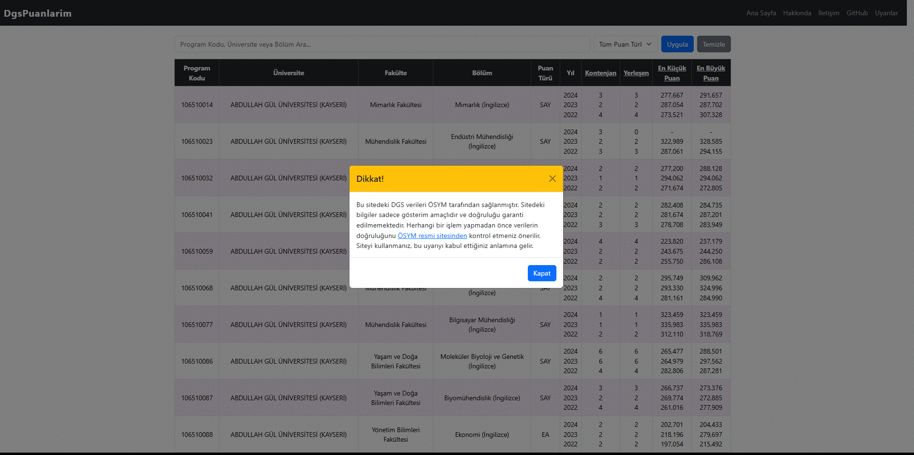

# DgsPuanlarim 🚀

[](https://dotnet.microsoft.com/en-us/apps/aspnet) 
[](https://docs.microsoft.com/en-us/ef/core/) 
[](https://getbootstrap.com/) 
[](LICENSE)

DgsPuanlarim, ÖSYM’nin yıllık yayınladığı DGS (Dikey Geçiş Sınavı) verilerini kullanarak **2022, 2023 ve 2024 yıllarındaki tüm programları tek bir sayfada listeleyen bir web uygulamasıdır**.  

Mevcut DGS puan siteleri genellikle tüm programları aynı anda göstermemektedir. Bu uygulama sayesinde:  

- Tüm DGS programlarını tek tık ile görebilirsiniz  
- Üniversite, fakülte veya bölüm adına göre arama yapabilirsiniz  
- Kontenjan, yerleşen veya puan bilgilerine göre sıralama yapabilirsiniz  

Tüm veriler **ÖSYM resmi sitesinden** alınmıştır.  

---

## 📸 Ekran Görüntüleri



---


## 🌟 Özellikler

- **Gelişmiş Arama & Filtreleme**: Program kodu, üniversite veya bölüm adı ile hızlı arama.  
- **Sıralama & Karşılaştırma**: Kontenjan, yerleşen ve puan bilgilerini artan/azalan şekilde sıralama.  
- **Yıllara Göre Karşılaştırma**: 2022, 2023 ve 2024 verilerini aynı tabloda görüntüleme.  
- **Mobil & Responsive**: Tüm cihazlarla uyumlu modern arayüz.  
- **İletişim Formu**: Sorular, öneriler veya geri bildirimler için kullanılabilir.  

---

## 🛠 Teknolojiler

- **Backend**: ASP.NET Core MVC, Entity Framework Core  
- **Frontend**: Razor Pages, Bootstrap 5  
- **Veritabanı**: SQL Server  
- **Diğer**: Python script ile ÖSYM Excel verilerinden SQL script üretimi  

---

## 💾 Kurulum

1. Repository’yi klonlayın:  
```bash
git clone https://github.com/mustafatavli195/dgspuanlarim.com.git
````

2. SQL Server’da bir veritabanı oluşturun (`dgs_db_v2`) ve `appsettings.json` içindeki bağlantı stringini güncelleyin.

3. Veriler klasörünün içinde DgsPuanlarimDb.csv dosyasını kullanarak temizlenmiş veritabanını istediğiniz platforma akatarabilirsiniz.

4. Gerekli NuGet paketlerini yükleyin:


```bash
dotnet restore
```

4. Database migration ve seed işlemlerini çalıştırın:

```bash
dotnet ef database update
```

5. Uygulamayı çalıştırın:

```bash
dotnet run
```

Tarayıcıdan `https://localhost:5001` adresine giderek uygulamayı görüntüleyebilirsiniz.

---

## 📊 Veriler

* **2022, 2023, 2024 DGS verileri** kullanılmıştır
* Veriler ÖSYM resmi sitesinden alınmıştır: [ÖSYM DGS Verileri](https://www.osym.gov.tr/TR,30722/2024.html)
* 2025 verileri henüz yayınlanmamıştır

---

## 🌐 Canlı Demo

* Şu anlık **yerel olarak kendi bilgisayarınızda çalıştırabilirsiniz**
* Çok yakında uygulama **online olarak deploy edilecektir**


---

## 📬 İletişim

* Email: [tavlioffical@gmail.com](mailto:tavlioffical@gmail.com)
* LinkedIn: [Mustafa Tavlı](https://www.linkedin.com/in/mustafatavli/)
* GitHub: [dgspuanlarim.com](https://github.com/mustafatavli195/dgspuanlarim.com)
